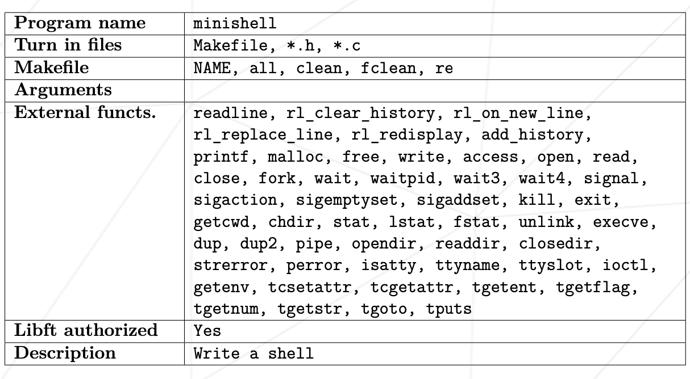
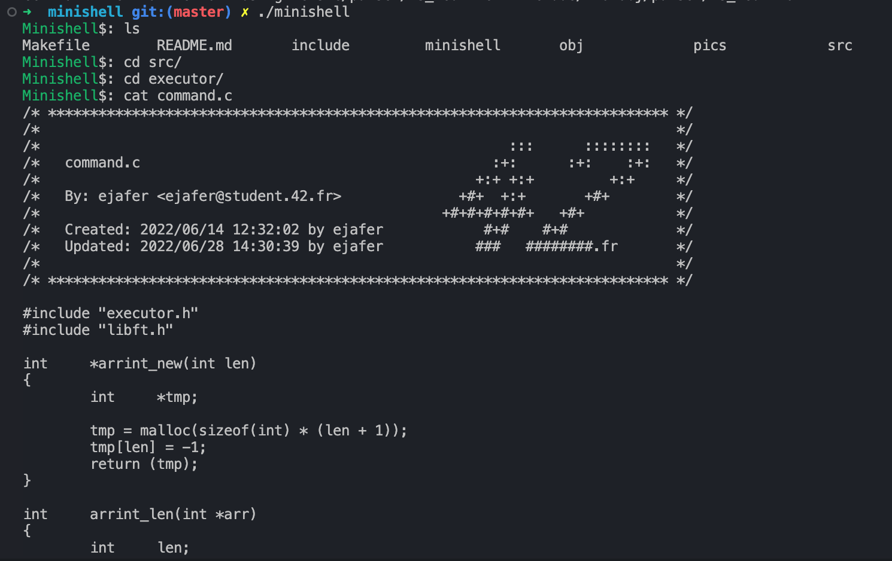
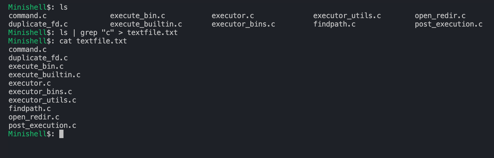

# Minishell

42 School team project. The goal of the project is to recreate some of shell behaviors.

## Specific rules of the project



## Compilation and launch
For Ubuntu users:

```bash
sudo apt-get install libreadline-dev
```

```bash
make
```

```bash
./minishell
```

For Mac users:

```bash
make
```

```bash
./minishell
```


## Features

- Working history
- Handling single- ' and "
- Redirections( <, >, <<, >> )
- Pipes |
- Environment variables $
- Handlind Ctrl-C Ctrl-D Ctrl-\
- Shell builtins( echo -n, cd, pwd, export, unset, env, exit )

## Screenshots




